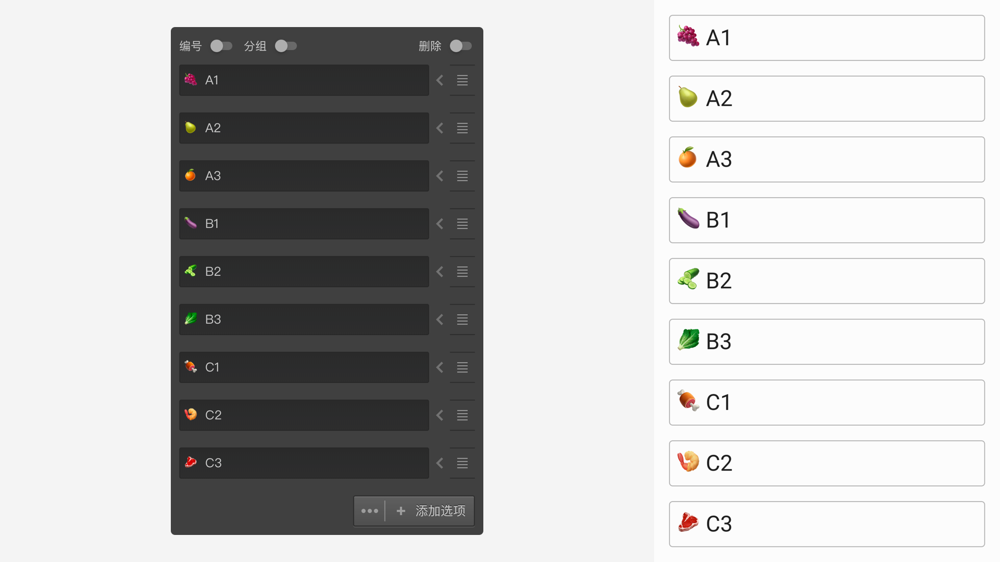

# 问题通用设置

通用设置用于设置问卷题型最基本的属性，不同题型的通用设置内容不完全相同。这里仅展示了最为通用的几个部分，题型独有的置会在各自的[题目类型](../nodes/concept.md)中详细说明。

## 必答题

控制该题是否必须回答，必答题则只有输入了答案才能进入下一题，非必答的题目可以被跳过，即不输入任何答案就进入下一题。

## 多选题

对于选择类型的题目，会有该控制项，默认为关闭，关闭状态也就是单选题。开启后，可以控制必须选中选项的数量范围，如果被访者选中的数量不在设定范围值内，无法进入下一题。

## 最小输入项限制

对于输入、打分类型的题目，会有该项控制，默认为关闭，即所有的选项都要被输入。开启后，可以设置数量，当被访者输入的项目数量达到该数量即可，如未达到，则不允许进入下一题。

## 选项随机

控制选项在答题时打乱顺序随机展示，详细规则参见[选项随机](./option-random.md)。

