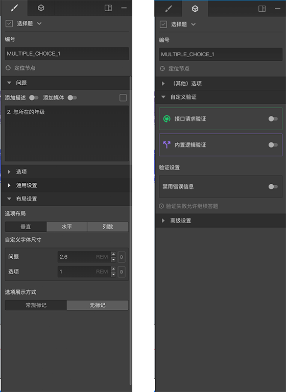

```index
1
```
```tag

```
```summary

```
# 节点通用设置

选中一个节点后，右侧属性编辑栏中会显示该节点的设置内容，顶部一般会包含2个tab，点击tab可以切换属性编辑区内容，每个tab下面会有多个功能区，点击功能区的头部标题可以展开或收起该功能区。



> 上面的示例图中，包含两个tab，第一个tab中有`问题`、`选项`、 `通用设置`、 `布局设置`四个功能区，第二个tab中有`其他选项`、`自定义验证`、`高级设置`三个功能区，有些功能个区是展开状态，有些功能区是收起状态。

不同的节点可能包含不同功能区，相同的功能区对于不同的节点而言，其设置内容也可能有些细微差异，点击下方的链接查看每个功能区的详情。

## -----[头部](./header.md)
## -----[问题设置](./question.md)
## [选项设置](./option.md)
## [选项排他](./option-exclude.md)
## -----[输入验证](./input-validation.md)
## -----[自动提示](./auto-complete.md)
## -----[通用设置](./common.md)
## -----[选项随机](./option-random.md)
## -----[布局设置](./layout.md)
## -----[其他选项](./other-option.md)
## -----[自定义验证](./custom-validation.md)
## -----[高级设置](./advanced.md)
