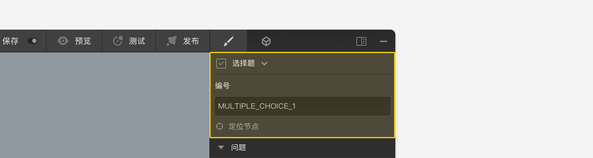
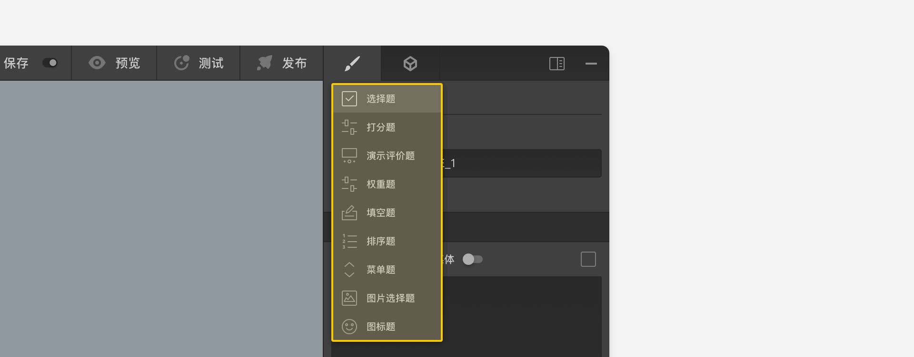

# 节点设置头部区

节点设置面板的头部区域显示了该节点的类型，编号，和定位按钮，

点击节点类型将当前节点切换到其他的题型。在不同的题型之间切换时，只有两种题型之间共有的设置才会被保留，有时候选项的连线也会被自动丢弃。

编号是当前节点的唯一标记，在问卷中不能存在编号相同的题型节点。编号可以编辑修改，当引用节点、逻辑设定时常常会通过编号来引用。

点击定位按钮后该节点会被移动到编辑器画布区中央。
