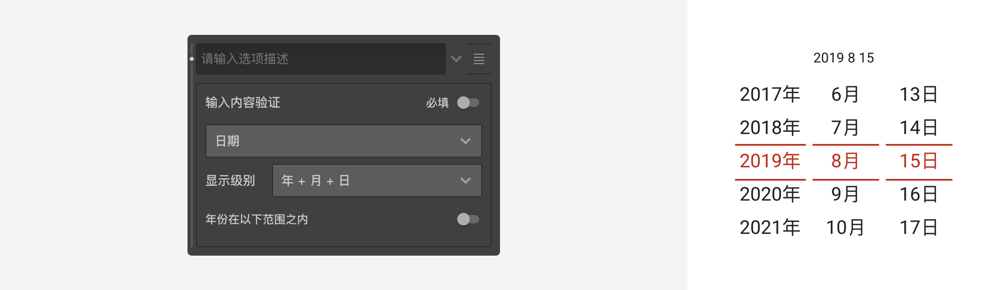
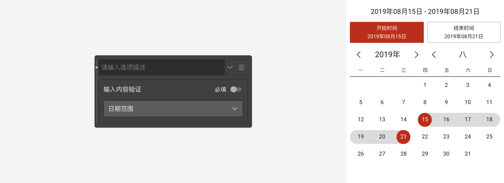
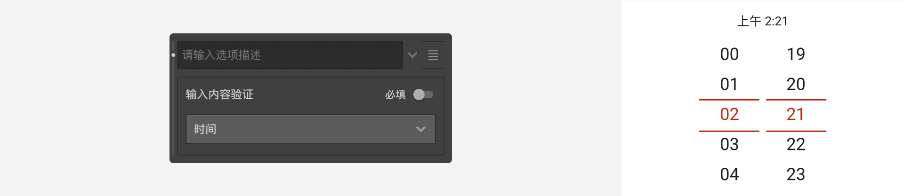
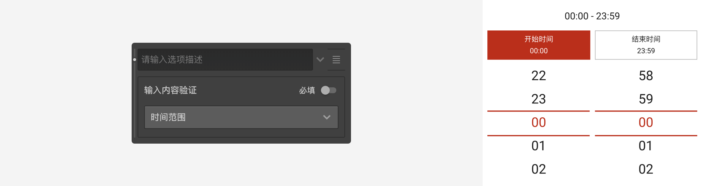
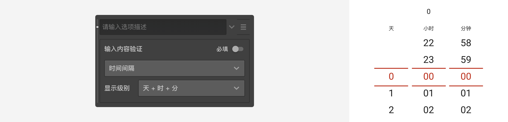
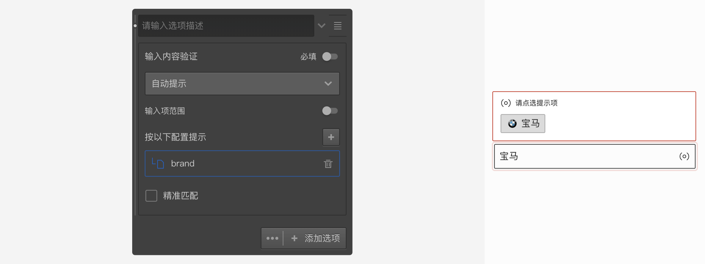
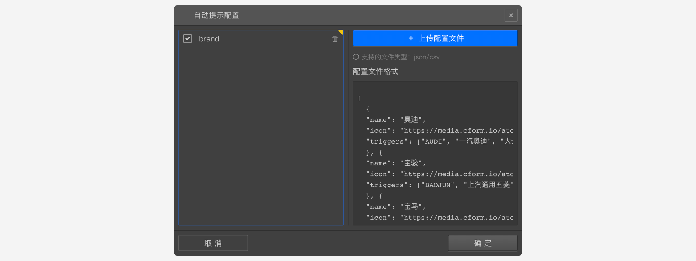
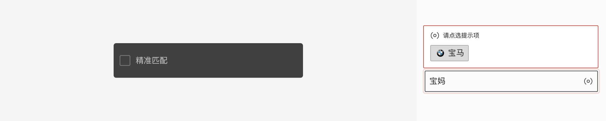
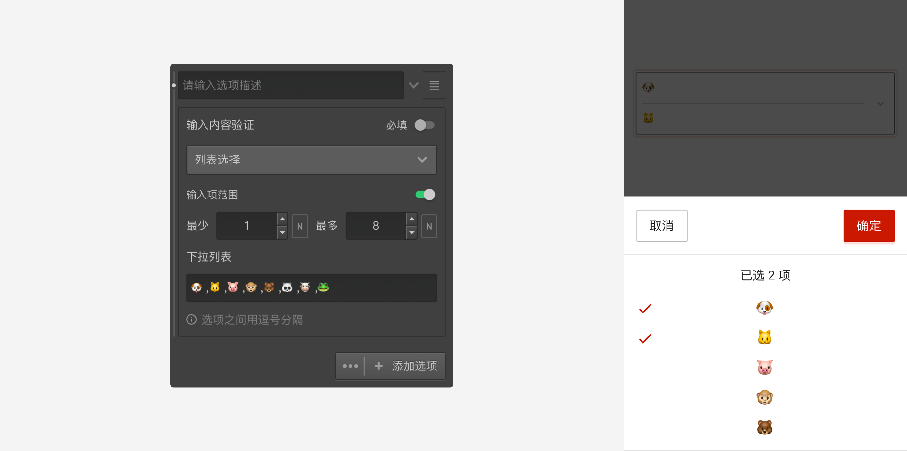

```index
5
```
```tag

```
```summary

```
# 输入验证

对于填空题选项、选项备注栏等需要输入任意内容的地方添加输入验证规则，可限制输入指定类型的数据，防止收集到无用的内容。


点击这些选项右侧的`附加设置`小箭头按钮，打开输入验证选项面板，


## 必填
开启`必填`开关，代表该项必须输入内容，不输入则会报错，且不能进入下一题。


## 内容验证
检查输入是否满足指定格式，如果不满足则报错。点击设置面板中的下拉列表可以选择验证规则，以下是内置验证规则的说明：

### 字符
表示可以输入各种文字，数字或符号。


选中字符规则后，会出现三个勾选框：`数字`、`英文`、`中文`用于限制输入字符的类型，如果不勾选任何项目，则表示允许所有字符，当勾选指定项目后，表示只允许输入所选规则的字符。

可以设置输入字符数量的范围。

### 整数
表示只可以输入整数。

可以设置输入整数的值的范围。


### 手机号码
必须输入适用于中国大陆规则的11位手机号码。


### 邮件
必须输入有效的邮箱地址格式内容。


### 日期
必须输入有效的日期格式，可以选择精确到年、月还是日，还可以控制可接受的年份范围。
  + 日期
  
  + 日期范围
  

### 时间
必须输入有效的时间格式（时分秒）。


### 日期范围
必须输入日期范围，从开始日期到结束日期。


### 时间范围
必须输入时间范围：从开始时间到结束时间。


### 时间间隔
必须输入时间间隔：即多长时间。


### 小数
必须输入小数，同时可以控制小数位数和小数数值范围。
  

### 邮编
必须输入有效的邮政编码。


### 网址
必须输入有效的网址，


### 自动提示
选择该类型时，当被访者在输入框中输入内容时，会根据输入的内容弹出提示标签，被访者选择提示标签作为真正的输入内容，任意输入的内容是无效的。


使用时，先要上传自动提示配置文件。如下图，Brand就是一本配置文件，用于指示系统如何根据用户的输入，弹出对应的匹配项。


自动匹配默认采取宽泛的弱匹配方式，以返回更多的选项供被访者选择。如下图中，被访者输入`宝妈`时，会匹配到`宝马`。


打开`精准匹配`，采取严格的匹配方式，此时输入`宝妈`时，则不会匹配到任何对象。


自动提示配置具体规则参见[自动提示](./auto-complete.md)。

### 列表选择
选择该类型时会出现一个下拉列表配置框，在里面配置列表项，列表项以半角逗号作为分隔符。
  
可以控制选择项目数量的范围。被访者回复问卷时，点击输入框后出现选择项列表，从中选择作为输入内容。


