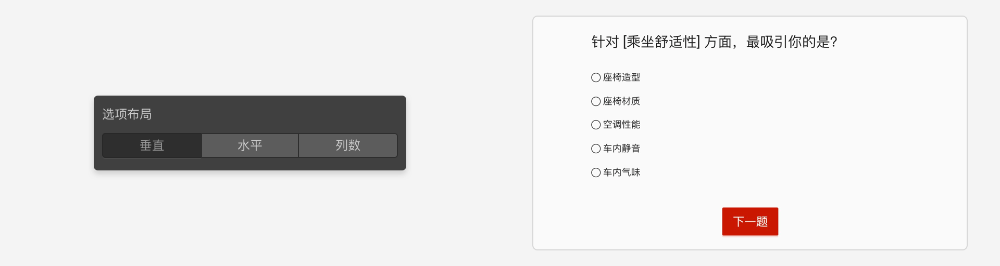
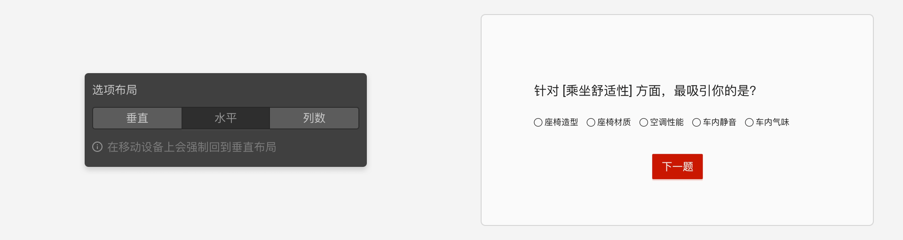
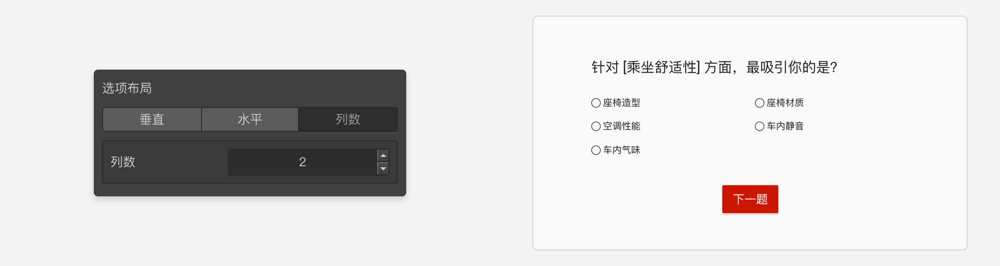
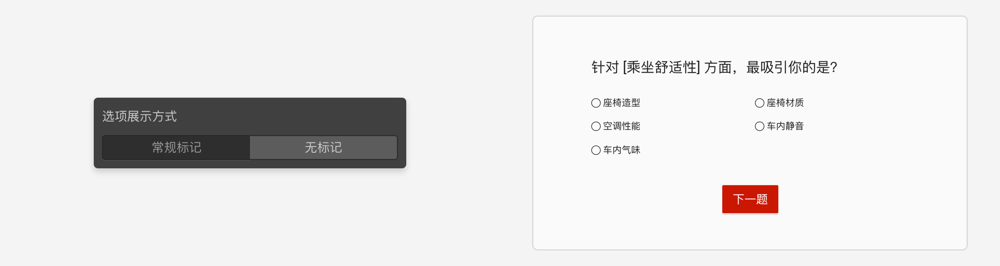
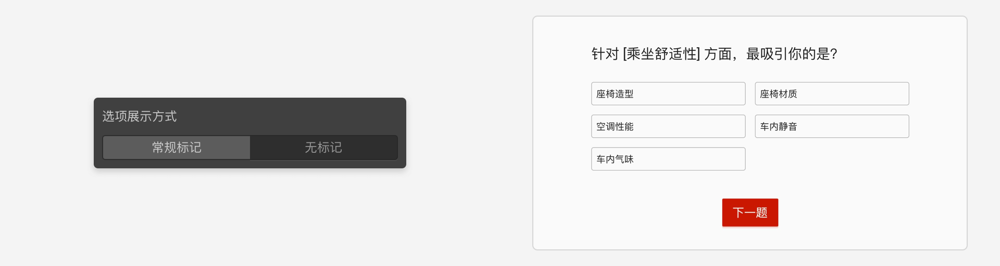

# 布局设置

在全局主题样式控制的基础上，问卷的每个题目节点还可以对自己的样式再进行局部调整。此时单个节点的样式脱离全局样式控制，而由自己的设置单独控制。

鼠标覆盖后小绿点后会变小红点，同时显示隔离说明，点击这个小红点可以解除隔离，解除隔离后该节点又会自动追随全局的字体设置了。

## 选项布局

用于设置选项的排列方式，可选横向排列或纵向排列，或者设定为按列数排列。
> 只有部分题目有该设置。

## 自定义字体尺寸
调节页面文字的大小和粗细。在全局的的[样式控制](../theme/concept.md)中，也有字体控制。字体控制默认是全局样式控制的，全局样式中字体大小进行改变时，所有节点的字体大小属性都会跟随着改变。然而，当在节点的布局设置中更改某个字体设置后，对应的设置项前面会出现一个小绿点，这个小绿点表明该项设置已经隔离的全局设置，无论全局设置如何改变，这个节点的设置会保持不变。

## 选项展示方式

只有部分题型具备该设置，参见[题目类型](../nodes/concept.md)中的详细说明。

