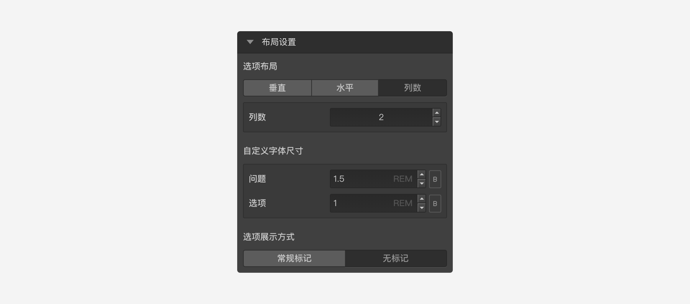

```index
10
```
```tag

```
```summary

```
# 布局设置

布局设置用于设置题目选项的布局，并可以对选项内容进行仅对该题目有效的局部调整。



## 选项布局

用于设置选项的排列方式，可选`横向排列`、`纵向排列`，或者设定为按`列数`排列。

## 自定义字体尺寸

用于调节题目页面里问题和选项文字的大小。

字体控制默认是由全局样式控制的，全局[样式控制](../theme/concept.md)中字体大小改变时，所有问卷节点的字体大小都会跟随着改变。

然而，在节点的`布局设置`中更改字体设置后，对应设置项前面会出现一个小绿点，表明该项设置已经隔离的全局设置，无论全局设置如何改变，这个节点的设置会保持不变。鼠标覆盖后小绿点后会变小红点，同时显示说明，点击小红点解除隔离，解除隔离后该节点又会自动跟随全局的字体设置了。
