```index
4
```
```tag

```
```summary

```

# 选项设置区

选项设置用于设置题目选项的属性，对于不同题目，选项可编辑的属性会有差异，例如：
+ 选择类型的题目需要被访者在多个选项中选择；
+ 打分类型的题目需要被访者对主题的多个方面进行评分；
+ 输入类型的题目需要被访者输入多项内容；

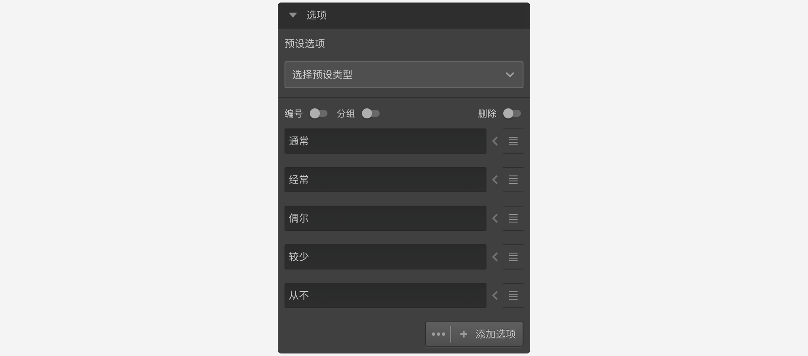

具体差异参见[题目类型](../nodes/concept.md)中说明。

## 预设选项
系统提供了一些预设选项集，点击打开列表从中选择合适的项目，可以快速生成选项。
选择题预设了一些常用的选项内容，选择即可直接使用预设的选项内容。


预设内容类型有：
  + 性别
  + 年龄
  + 婚姻
  + 学历
  + 行业
  + 职业
  + 职位
  + 收入
  + 同意/不同意
  + 满意/不满意
  + 可能/不可能
  + 熟悉度
  + 适量
  + 兴趣
  + 容易/难
  + 频率
  + 更好/更坏
  + 赞同/反对
  + 平均
  + 质量
  + 是/非
  + 意向
  + 有用度
  + 价值
  + 清晰度
  + 比重
  + 友好度

## 选项编号
开启`编号`开关，打开选项编号输入框。选项的编号只能是数值，且不能为空值，同一道题目的选项编号不能相同。选项编号可以在变量中引用。
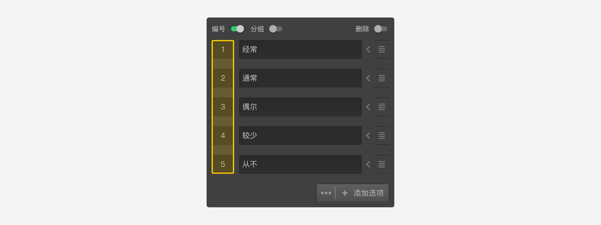
如果没有特殊需求，使用系统生成的选项编号即可。

## 分组编号
开启`分组`开关，打开选项分组输入框。相同分组编号的选项为同一组。
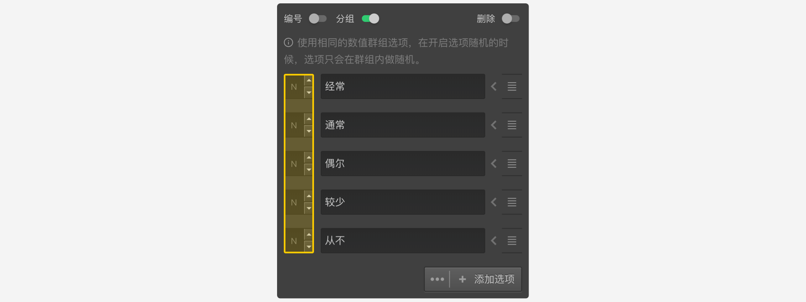
选项分组会在[选项随机](./option-random.md)中分组随机相关场景使用，一般不需要进行分组。

## 选项排序
每个选项的右边都有一个拖拽图标，按住图标上下拖动对选项排序。
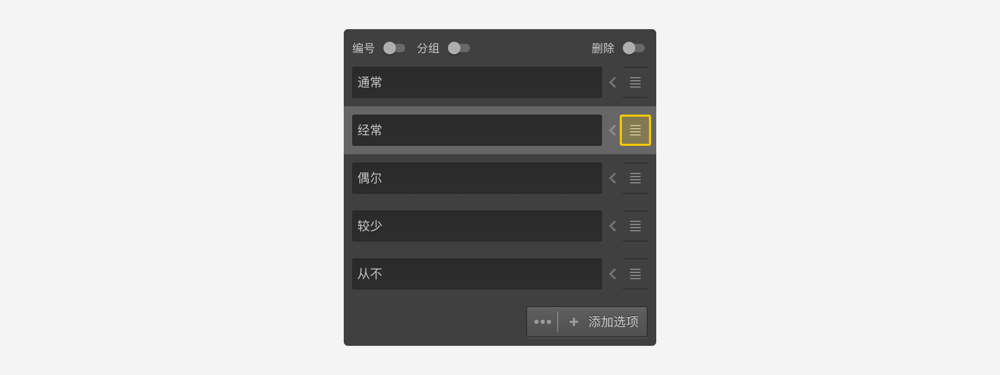

## 新增选项
创建题目节点时会默认携带几个空白选项，在选项输入框中输入选项名称即可。需要更多选项时，点击选项列表下面的`添加选项`按钮，可以添加1个空选项。
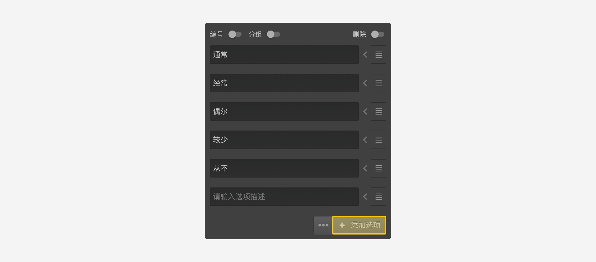

  > 当光标在某个选项输入中时，按下`Enter`键可以在该选项之后插入一个空选项。

## 批量添加选项
支持批量添加选项，在画布中双击题目节点，可以打开`批量输入`窗口，窗口中的每一行就是一个选项。输入完成后点击`确定`，就会按行分自动生成题目选项。


批量输入时支持输入变量内容。
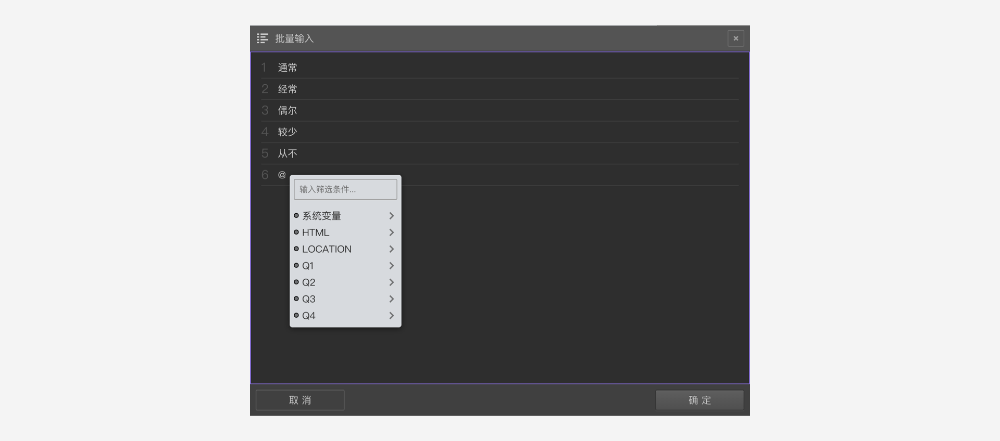

## 删除选项
开启选项列表右上方的`删除`开关，所有选项右侧的拖拽图标会变成删除图标，点击删除图标就会删除该选项。关闭`删除`开关，变回排序图标。
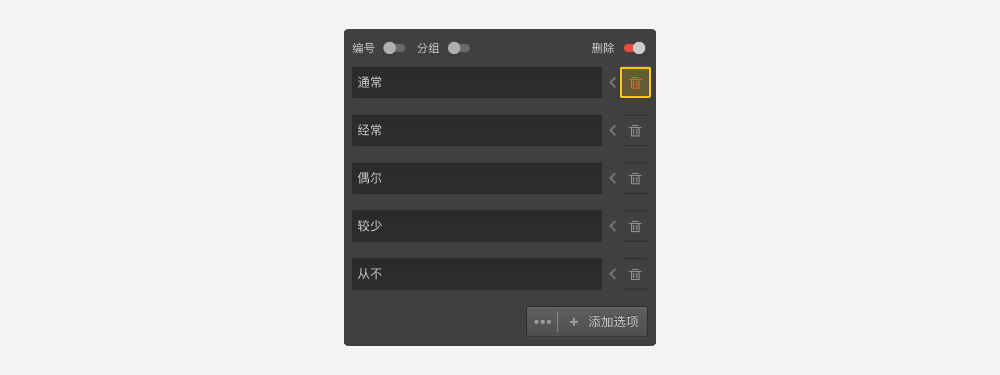

## 附加设置
有些选项的输入框和排序图标之间会有个小箭头图标，点击这个小图标打开该选项的`附加设置`。不同题型的附加设置各有不同，可参见[题目类型](../nodes/concept.md)中的详细说明。
下图是打开选择题`附加设置`后，可将当前选项开启为`选项备注`，当被访者选择`非常不满意`后，将会提示要求输入不满意的具体原因。


> 在附加设置中进行过设置的选项，无论是在选项编辑区还是画布中的节点方块中，对应选项的前面会有个小白点作为提示标记

## 高级控制
点击`添加选项`按钮的左边的3个点的图标，弹出题型的`高级控制`菜单。
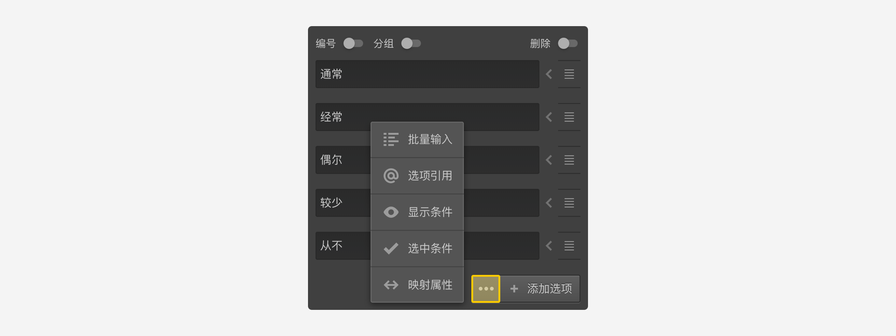

`高级控制`菜单包含下列功能：
+ 批量输入：点击后打开`批量输入`窗口。

+ 选项引用：点击后添加`选项引用`配置。
  
添加选项引用配置后，选项列表后面会展示引用配置的列表，具体参见[选项引用](../opt-reference/concept.md)。

+ 显示条件：点击后对选项的显示进行控制。
  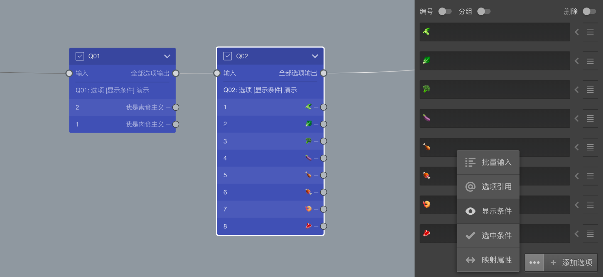
  点击后，弹出`选项显示逻辑设置`窗口，在其中进行设置。
  下图中，Q01是一道选择题，被访者可从素食或肉食中选择一个，Q02是在Q01基础上进一步呢询问具体吃一些什么，很明显，素食和肉食者看到的内容是完全不同的。
  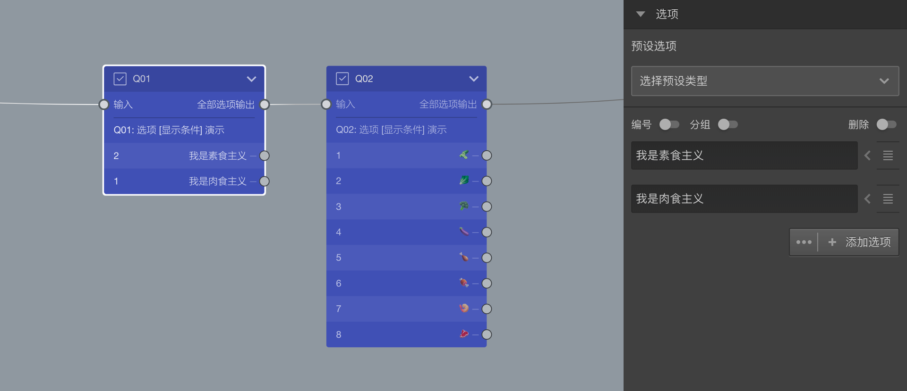
  为了实现Q02根据Q01的选择显示部分选项的功能，打开`选项显示逻辑设置`窗口。
  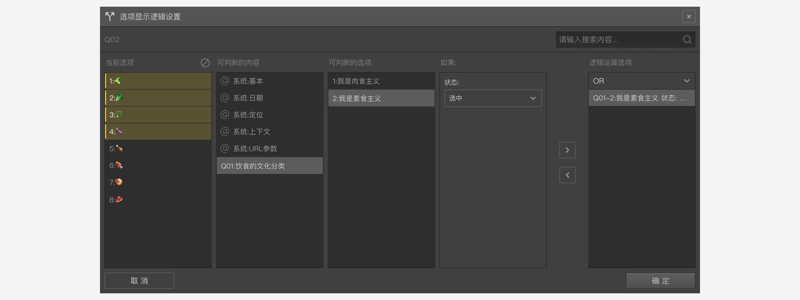
  随后，按以下步骤设置：
    + 在`当前选项`列表中，选择编号1-4的4款素食；
    + 在`可判断的内容`列表中，选择Q01，`可判断的选项`列表会显示Q01的所有选项；
    + 在`可判断的选项`列表中，选择“我是素食主义”；
    + 在`如果`列表中，设定判断条件，这里设定为`选中`;
    + 点击`>`按钮，在`逻辑运算选项`中加入该判断；

  设定完毕后，当被访者在Q01中选择素食时，Q02的选项就只会显示属于素食食材的选项了。反之亦然。

  + 扩展案例

    下面我们来看几个选项引用的扩展案例，
    首先，按下面图示，创建2个选择题节点，并设定Q01的选项。
    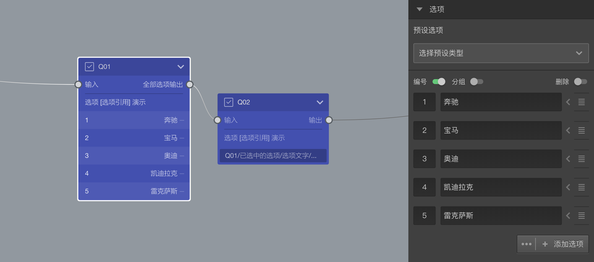
    随后，设置Q02的选项。
    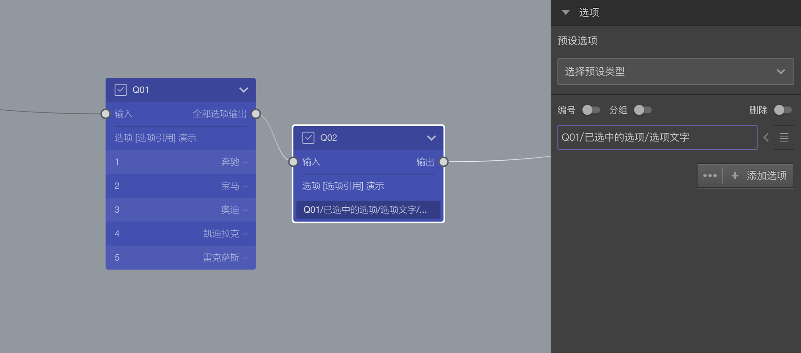

    + 引用不同的属性：选项引用时，可以选择引用选项的不同属性，以满足不同的需求。
    下图是Q02的选项引用Q01中已选中选项的文字内容：
    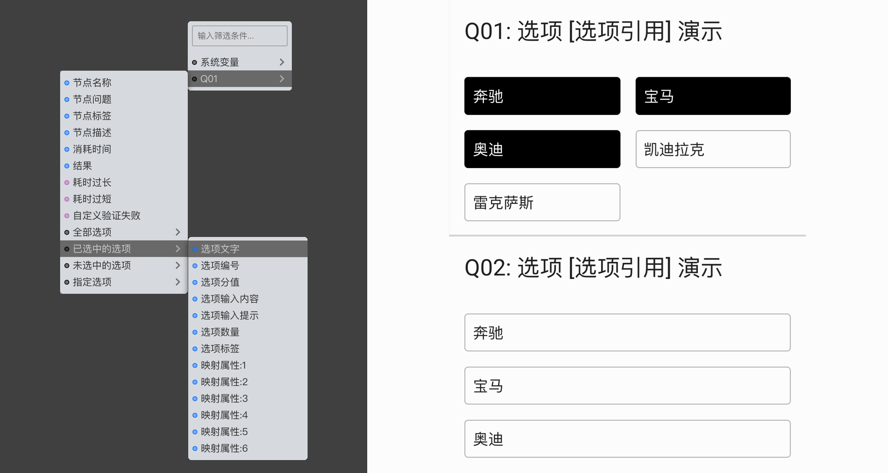
    下图是Q02的选项引用Q01中已选中选项的选项编号：
    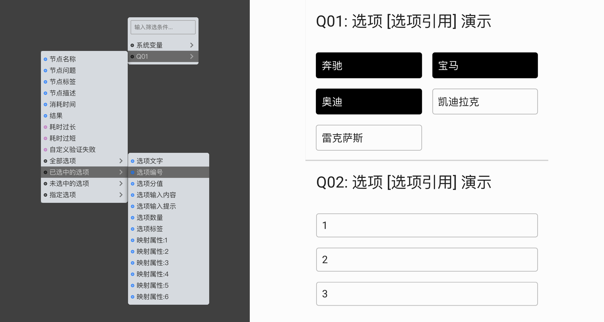

     + 叠加过滤条件：可以对引用过来的选项再叠加判断条件。点击Q02的引用选项，弹出过滤设置面板。
    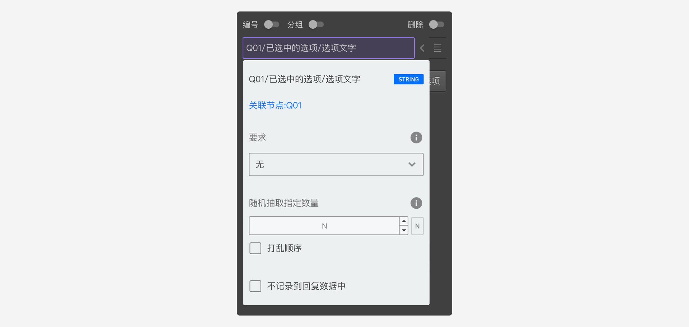
    按下图设置，我们可以在Q02中仅仅引用Q01中选项编号大于1的选项的文字。
    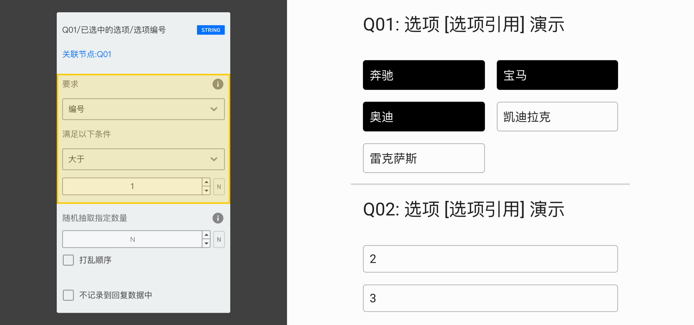
    其实，除了编号外，还可以判断一切其他的属性，有以下可判断属性：
    

    + 从符合条件的选项中随机抽取引用：可以从符合条件的所有选项中，抽取一部分引用到当前题目。
    下图是Q02的选项从Q01中已选中选项抽取2个，并引用抽取到的选项的编号。
    
    再进一步，还能对抽取到的选项进行随机排序。
    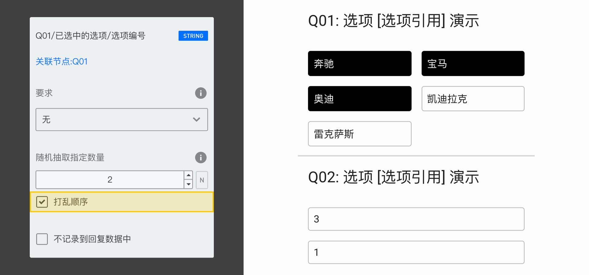

+ 选中条件：对选项的自动选中进行控制，符合条件时，题目出现时就会按条件勾选选项。仅对选择类型题目有效。
  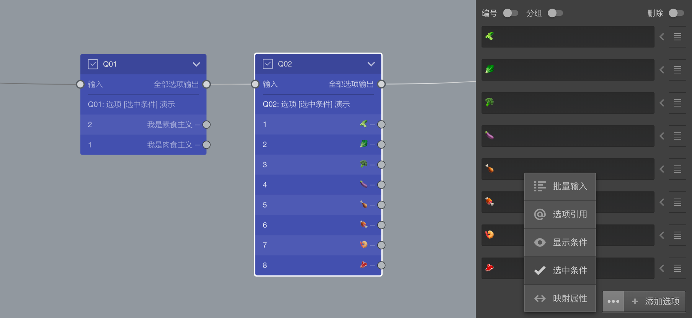
  点击后，弹出`选项选中逻辑设置`窗口，在其中进行设置。
  下图中，Q01是一道选择题，被访者可从素食或肉食中选择一个，Q02是在Q01基础上进一步呢询问具体吃一些什么。
  现在，我们希望当Q01选择肉食时，Q02能自动勾选所有肉食食材选项，打开`选项选中逻辑设置`窗口。
  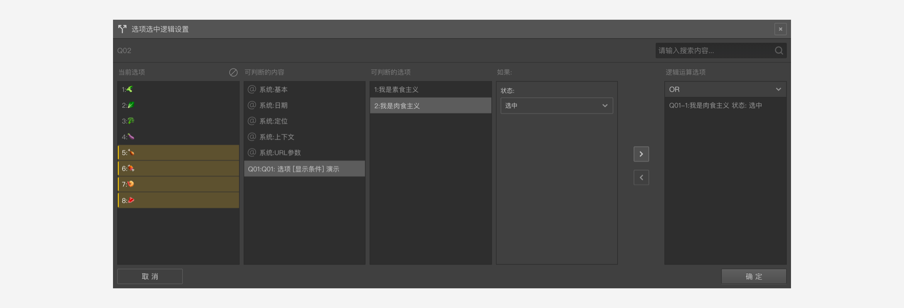

  随后，按以下步骤设置：
    + 在`当前选项`列表中，选择编号5-8的4款素食；
    + 在`可判断的内容`列表中，选择Q01，`可判断的选项`列表会显示Q01的所有选项；
    + 在`可判断的选项`列表中，选择“我是肉食主义”；
    + 在`如果`列表中，设定判断条件，这里设定为`选中`;
    + 点击`>`按钮，在`逻辑运算选项`中加入该判断；

  设定完毕后，当被访者在Q01中选择肉食时，Q02的肉食食材选项就只会被自动勾选。在这个基础上，被访者可以选择更多选项，或者去掉自动勾选项。

+ 自动赋值：针对输入输入类型题目的设置，点击后弹出`选项自动填充`窗口，在其中进行设置。

+ 映射属性：编辑选项的映射数据，点击后弹出`选项映射`窗口，在其中进行设置。
  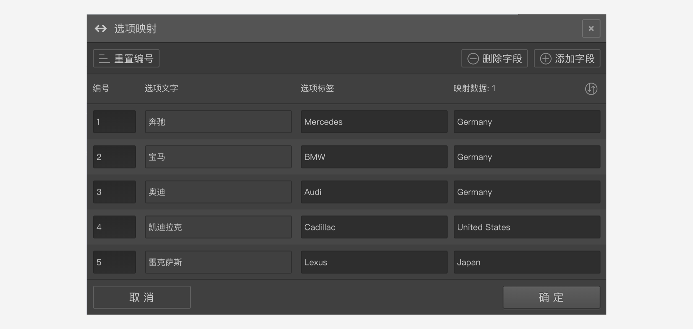
  

> 根据不同题型，`高级控制`菜单列表中的内容会略有不同。