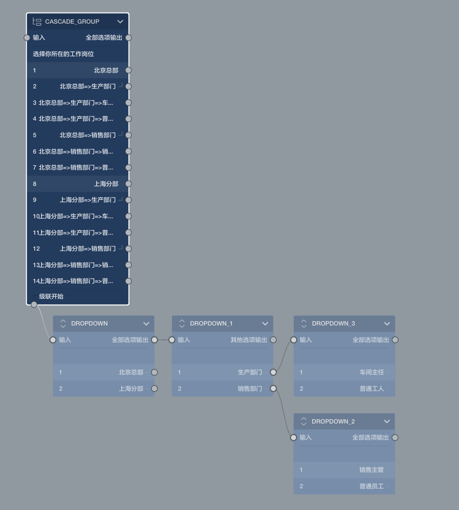

```index

```

```tag

```

```summary

```
# 级联题

> 不同题型或功能节点共有的通用设置在[节点设置](../node-setting/concept.md)中有讲解，此处只讲解级联题特有的功能。

级联题适用于选项存在层级关系的题目，让受访者以层层嵌套进行选择的方式来答题。



## 独有特性

级联题题型本身不能设置选项，级联题的选项是多层嵌套的关系，需要结合菜单题来实现。

级联题节点方框底部有个`级联开始`的输出口，把这个口输出到菜单题，如上图所示，每一层节点代表级联在该层的选项数据，最多支持三层级联。级联数据组只能使用[菜单题](./menu.md)节点充当，使用其他节点会报错，且拒绝生成级联选项。

以上图的设计为案例，该题询问员工所在的职位：
+ 第一层，让员工选择在上班所在地；
+ 第二层，让员工选择所在的部门；
+ 第三层，因为不同的部门所有有的职位是不一样的，所以从第二层的各个选项项出输出到了代表不同工种的菜单节点中。

连接到级联开始下面的那些菜单题，被称为`级联数据组`，当连接好级联数据组后，级联题节点上会自动平摊与级联数据组的关联关系，生成一堆选项。要改变这些选项的话，只能通过改变级联数据组的方式实现。

连接到级联题后，级联数据组中的菜单题只是充当级联数据的提供者，不再当成一道题目，答题过程中也不会以题目形式单独出现。其问题设置会被隐藏，选项数据则被当成级联数据，通用设置中和布局设置中的一些设置也被当成所在级联层的配置：

+ 必答题：表示所在级联层必须做出选择；
+ 多选题：表示所在级联层可多选，并可以指定多选数量范围；
+ 选项随机：表示所在级联层展示的时候会打乱选项顺序；

### 选项展示方式

布局设置中可以单独控制所在级联层的菜单弹出方式，级联题提供了三种展示方式：
+ 下拉列表：每一层都使用下拉列表方式选择，选择完后，内层的选项又会展示出来；
+ 标签选择：以左右分栏的列表方式进行选择，这种方式只支持两层级联嵌套；
+ 层级展开：像多层的选择题一样展示，选中部分会层层展开，以供继续选择；
