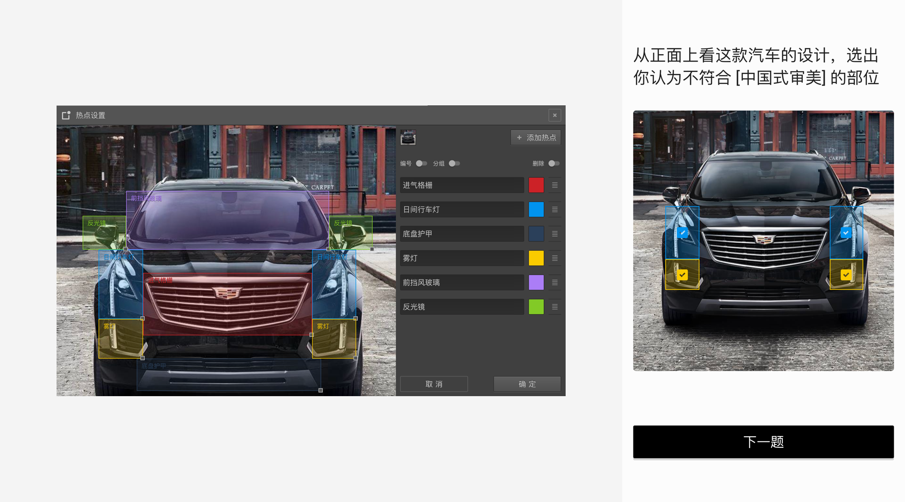
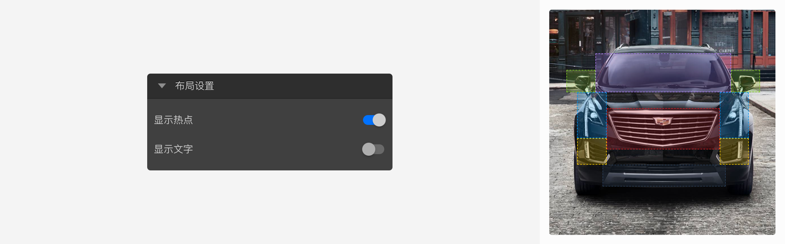
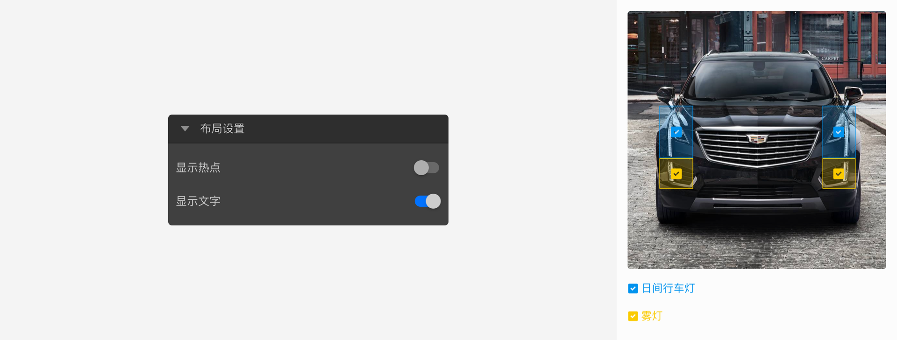

```index

```

```tag

```

```summary

```
# 图片热点题

图片热点题会呈现一张图片给被访者，提示被访者在图片上点击关注的热点，答题过程中，被访者点中热点所在区域就代表选中对应选项。


## 选项设置

点击编辑选项按钮，打开热点设置对话框。图片热点题需要一张背景图片，点击对话框右上角的图片选择器添加一张背景图片。随后，点击添加热点按钮在背景图片上添加一个正方形热点，拖拽热点框到目标位置，点击确定完成设置。


随后，添加图片热点，点击`添加热点`按钮在背景图片上添加一个正方形热点，拖拽该热点框到图片的目标位置，点击确定完成设置。答题过程中，被访者点中热点框就代表选中该选项。

图片热点题支持添加多个热点框，每个热点框就是一个选项。多个热点框之间不能重叠。

## 布局设置

+ 显示热点：开启后，图片上会显示热点所在区域，提示被访者进行选择。


+ 显示文字：开启后，图片上会显示勾选框，提示被访者进行选择。


> 不同题型或功能节点共有的通用设置在[节点设置](../node-setting/concept.md)中有讲解，此处只讲解图片热点题特有的功能。