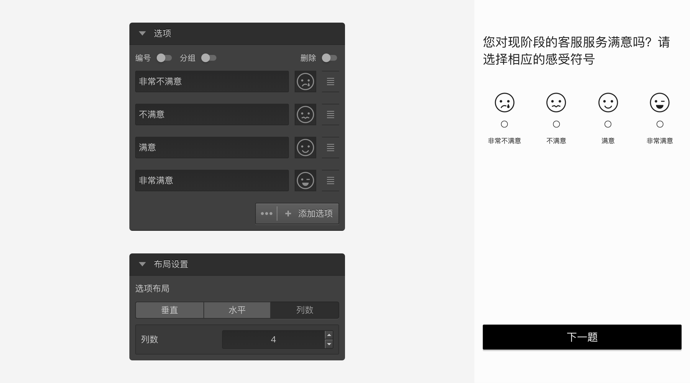
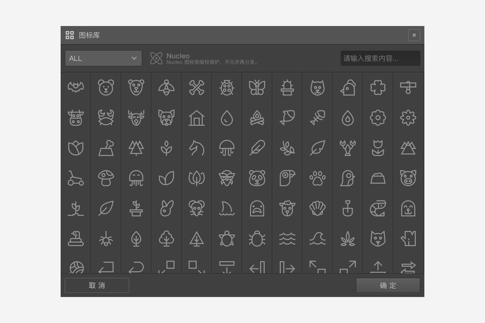

```index

```

```tag

```

```summary

```
# 图标题

`图标题`其实就是每个选项都是图标的选择题，各种设置与选择题相同。


## 选项设置

点击选项右侧的`图标设定`按钮，打开`图标库`对话框。


`图标库`对话框里展示了系统所有内置图标。点击对话框左上角切换图标类型。或者，在右上角输入框中输入图标名称，快速找到需要的图标。


## 布局设置

+ 选项布局：用于设置选项图标的排列方式，可选方式有：垂直、水平和指定列数。

> 不同题型或功能节点共有的通用设置在[节点设置](../node-setting/concept.md)中有讲解，此处只讲解图标题特有的功能。