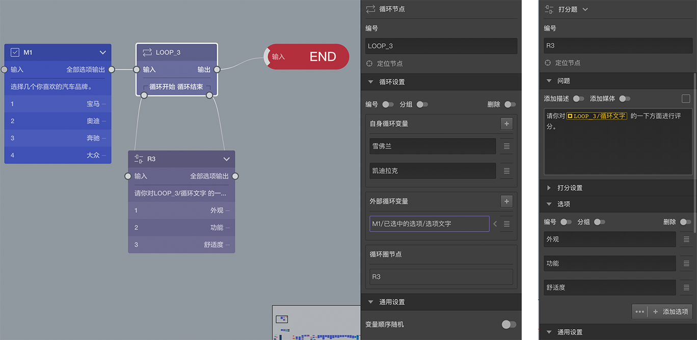

```index

```

```tag

```

```summary

```
# 循环节点

> 不同题型或功能节点共有的通用设置在[节点设置](../node-setting/concept.md)中有讲解，此处只讲解循环节点特有的功能。

`循环节点`用来控制在不同的条件下重复做一些题目，达到减少题目数量，简化问卷的目的。`循环节点`在答题页中不会被显示。



## 案例

考虑这样的情形：一份关于汽车的调查，我希望调查被访者对`雪佛兰`，`凯迪拉克`两个品牌的`外观`，`功能`，`舒适度`三个方面的印象。为了达到与其他品牌横向对比的效果，加入一些其他汽车品牌，也对他们询问同样问题。具体实现时，打算让被访者先从很多品牌中选择几个自己关注的品牌作为被加入的品牌。

从上面的需求可以看到最核心的题目就是询问三个方面印象的题目，只是该题要被询问多次，除了`雪佛兰`，`凯迪拉克`是确定要问的，其他会被问到的品牌数量是不确定的。

由于要询问的品牌和次数都源自于被访者在上一题中的选择结果，因此问卷设计阶段无法准确预知，所以用常规的方法和功能设计上面的题目会遇到无法解决的困难。

## 基本规则

在画布中，循环节点除了输入口和输出口外，底部还有循环开始和循环结束口。
+ 循环开始是一个输出口，可以输出到另一个节点。
+ 循环结束是一个输入口，可以接受其他节点的输出。

具体使用方法是，从循环开始输出连接到一些题目，这些题目最后的输出又要作为输入连接到循环结束，这样就实现了一个循环。循环开始和循环结束之间的节点被称为`循环圈节点`。

打开`属性编辑工具栏`，看到循环节点上可以设置[循环变量](../variable/loop-type.md)，包含`自身循环变量`和`外部循环变量`两种：
+ `自身循环变量`是在循环节点身上设定好的，是固定的。
+ `外部循环变量`是从之前的题目中引用过来的，是动态的。
> 其实自身循环变量与外部循环变量的关系，等同于题目中的选项与[引用选项](../opt-reference/concept.md)的关系。

答题过程遇到循环节点时，会把循环节点的`自身循环变量`和`外部循环变量`（这已由动态计算得出了固定结果）都取出来得到所有变量。系统会从中先拿出第一个，对`循环圈节点`中的所有题目询问一遍；问完后，又会拿出第二个，再对`循环圈节点`中的所有题目询问一遍；如此重复，直到所有变量都用完了，最后从循环节点的输出口继续后续的题目。

`循环圈节点`中的所有节点，都能使用[循环变量](../variable/loop-type.md)，代表每次重复针对`循环圈节点`发问时使用的内容，这样就能达到虽然每次都是使用同样的`循环圈节点`，但是每次展示的内容却不相同。

> 上图第二个右侧编辑栏中，`R3`的问题文字中展示了循环变量的使用方法。变量使用方法参见[变量使用](../variable/usage.md)。

## 案例解决方案

上图的问卷片段是实现案例需求的解决方案，分为以下步骤：
1. 先通过选择题M1，从其他品牌中让被访者选择一些自己感兴趣的品牌，作为加入循环的品牌；
2. 在循环节点LOOP_3中，自身循环变量设置为`雪佛兰`，`凯迪拉克`，因为这两项是固定的、一定会提及的；
3. LOOP_3的循环圈节点只包含一个R3，R3的问题文字中引用了循环变量；
4. 外部循环变量使用了`M1/已选中的选项/选项文字`，这是[选项引用](../opt-reference/concept.md)的规则。正是这个设定，将之前被访者感兴趣的品牌加入到循环里，与`雪佛兰`，`凯迪拉克`一起循环出示；

问卷实际运行时，如果被访者在M3中选择了感兴趣的品牌是`奥迪`和`大众`，那么循环圈节点总共会被询问4次，分别是：
1. 请你对`雪佛兰`的以下方面进行评分。
2. 请你对`凯迪拉克`的以下方面进行评分。
3. 请你对`奥迪`的以下方面进行评分。
4. 请你对`大众`的以下方面进行评分。

## 变量循序随机

循环变量使用的顺序可被打乱，其打乱规则与[选项随机](../node-setting/option-random.md)相同。

## 简化后的案例

如果问卷所有的条件和次数都是确定的，如：我们只调查`丰田`、`雷克萨斯`、`别克`、`大众`、`奥迪`等20个品牌，那么我们重复添加这20个选项到循环节点的`自身循环变量`，就可以实现针对20个品牌在这三方面进行询问的需求，提高问卷编辑效率。
