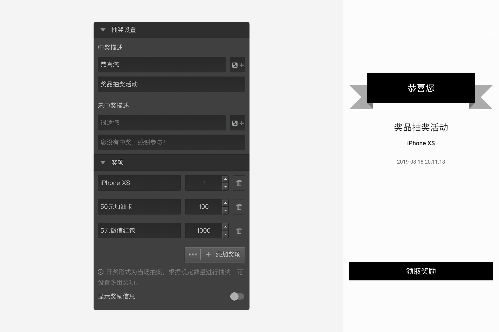
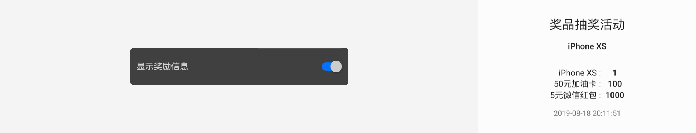

```index

```

```tag

```

```summary

```
# 抽奖节点


抽奖节点连在结束节点之后、奖励节点之前，作为结束节点和奖励节点间的桥梁，作用是按照设定的中奖策略决定当前被访者可以领取到的奖励。


## 抽奖设置



+ 中奖描述和未中奖描述
设置中奖和未中奖时候显示的页面文字和图片。

+ 奖项
可以设置一等奖、二等奖等多个奖项，画布中的每个奖项都有一个输出口可以输出到奖励节点。如果抽中某个奖项就会跳到该奖项对应的奖励节点，具体的奖励内容由奖励节点的设置具体决定。

如上图，设定的抽奖策略是：

|奖项|数量|
|:-:|:-:|
|iPhone XS|1|
|50元加油卡|100|
|5元微信红包|1000|

> 每个奖项必须设定有多少份。

## 显示奖励信息
如果开启该功能，则抽奖页面上会显示各个奖项名称和他们的数量。


> 不同题型或功能节点共有的通用设置在[节点设置](../node-setting/concept.md)中有讲解，此处只讲解抽奖节点特有的功能。
