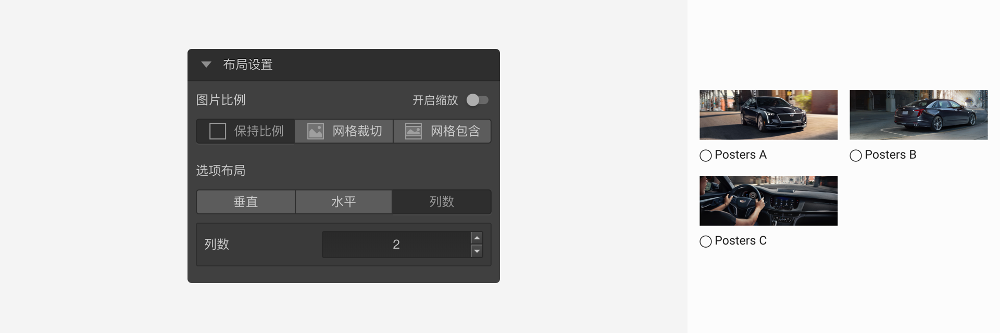
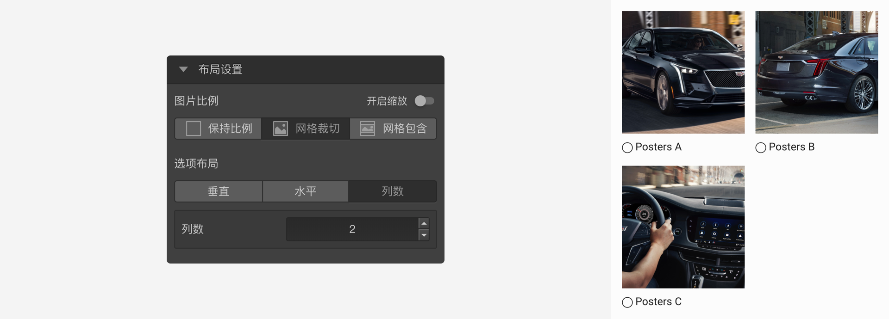
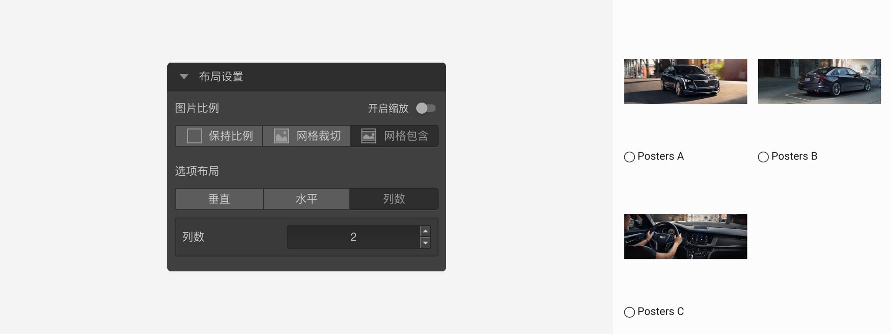
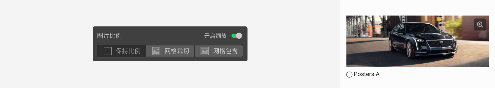

```index

```

```tag

```

```summary

```
# 图片选择题题

图片选择题是选择题的另外一种形式，可以看作是把图片当成选项的选择题，各种设置与选择题相同。


## 布局设置
布局设置用于控制图片展示方式。

+ 图片比例：
  用于控制图片的显示方式。
  + 保持比例：图片按原始比例显示，不会有裁切。
    
  + 网格裁切：图片自动撑满高度或者宽度，会有部分被裁切。
    
  + 网格包含：图片自动撑满选项网格容器，不会有裁切。
    

+ 开启缩放：
  用于控制图片是否可以放大，开启后，选项图片右上角会显示一个放大按钮，点击后放大该图片。
    

+ 选项布局：
  用于控制图片选项的排列方式。可设定为水平排列、垂直排列和指定列数排列。

> 不同题型或功能节点共有的通用设置在[节点设置](../node-setting/concept.md)中有讲解，此处只讲解图片题特有的功能。