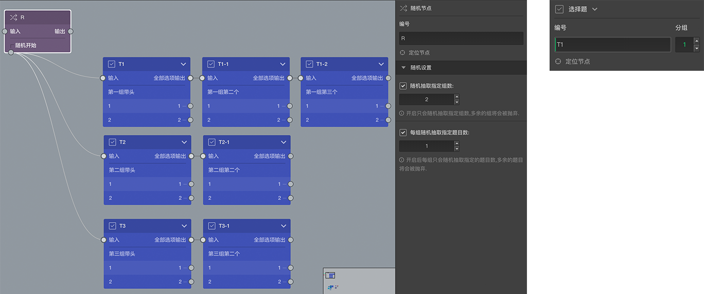

```index

```

```tag

```

```summary

```
# 随机节点

> 不同题型或功能节点共有的通用设置在[节点设置](../node-setting/concept.md)中有讲解，此处只讲解随机节点特有的功能。

随机节点作用就是在答题过程中打乱题目的出现顺序，也可以用来随机控制一些问卷题目是否出现在问卷中。

> 随机节点在答题页中不会被显示。



画布中，随机节点的底部有一个`随机开始`的输出口，可以连接到其他题目节点，`随机开始`输出口连接的节点称为`随机组节点`。这个输口出可以输出多次，连接到多个随机组节点，这些题目节点下面还可以连接其他后续节点，形成多个题目节点小组，称为`自然随机小组`，每个节点小组最前面的节点被称为`组头`。

如上图，随机开始输出了三次，形成了三个自然随机小组，每个小组可以包含任意题目数。

答题的时候碰到这个随机节点时，把这三个`自然随机小组`的小组顺序随机打乱并全部出示，打乱的只是小组的顺序，但小组里面的题目由小组题目节点连线决定，并不会打乱。当这个小组的题目问完后，会从剩下的小组中再抽出一组，如此重复，直到所有小组都抽完了，最后从随机节点的输出口去找后续的题目。

随机节点只能控制`自然随机小组`出现的顺序，不能随机控制小组内题目的顺序，这些题目的顺序是确定的。如果真想控制单独一道道题随机出现的顺序，可以把单独一个题当一个组。

除了随机控制小组出现的顺序，还可以随机控制出现的小组数量，以及每组随机出现的题目数量，这需要要右侧属性编辑面板中的随机设置中开启对应的控制开关。

### 随机抽取指定组数

开启该项后，可以在众多的随机组中抽取指定数量的题目组，其余的将会被丢弃。

> 如上图，开启并设置抽取2组，则随机过程中另外的某一组将会被丢弃。

随机节点可抽取的最大数量是其连接的节点小组的数量，但是还可以人为干涉。

选择每个组的`组头`，右侧属性编辑面板中头部编号的右边会有一个分组输入框，在这里可以为每个组设置分组编号.相同分组编号的多个小组，在随机抽取指定数量的时候会被看成是同一组，成为`实际随机分组`。如上图中，如果将第二组和第三组的的组头编号都设置为2，则实际随机小组的数量就会从3降为2，因为第二组和第三组是同一组。

> `实际随机分组`只会在随机抽取组数时生效,虽然第二组和第三组被合并到了实际随机分组，但是它们谁先出现依然是随机的。

### 每组随机抽取指定题目数

开启后，从每个`自然随机小组`的题目中随机抽取指定数量的题目，其余的将被丢弃。

> 如上图，设置了从每一组中随机抽取1题，则最终展示时第一组中有2题会被抛弃，2和3组中分别有一题会被抛弃，具体哪些题目被展示被抛弃是随机的，但最终肯定每组只一题，总共有3道题目将会被展示出来。

