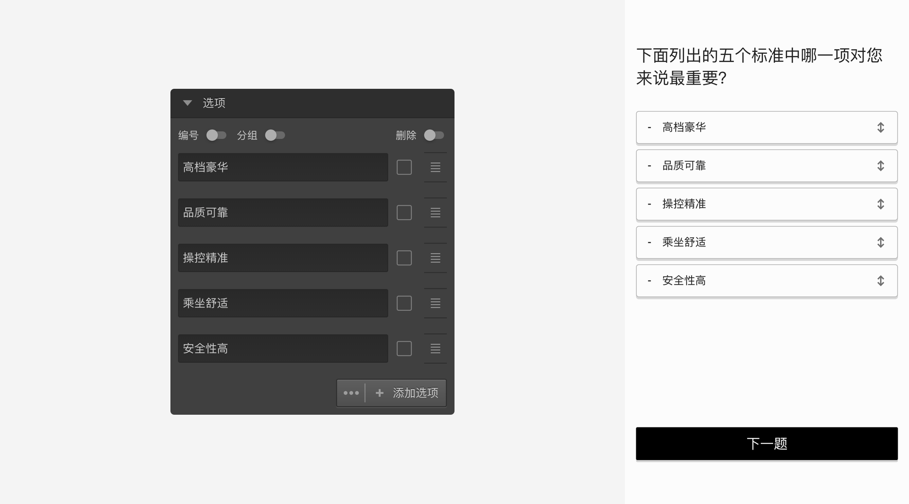
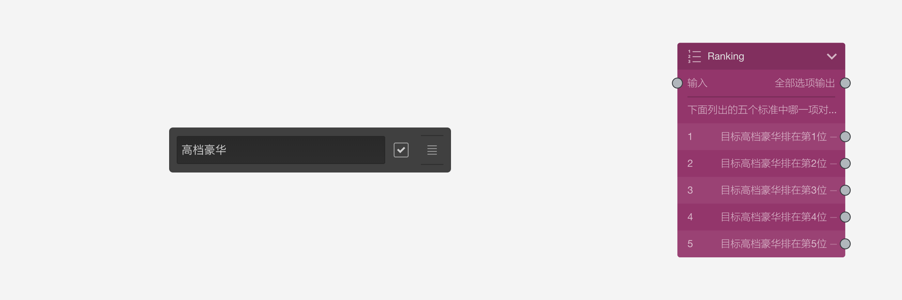

```index

```

```tag

```

```summary

```
# 排序题

排序题关注的是选项的顺序，被访者按题目要求，对题目选项排出先后顺序。排序题选项默认没有输出口。


被访者对选项进行排序时，按住选项右侧拖拽区域把选项拖出原来的位置，并放置到新的位置。当选项被移动到新位置后，选项前会显示一个排位序号数字。


## 选项设置

+ 排序目标：

有时，我们会关注某个选项的所在位置。此时，勾选选项右侧的`目标选项`勾选项，把该选项设定为目标选项，意味着这个选项是排序的关注目标。这时，画布中排序题节点的选项会出现输出口，代表如果目标选项被排到该选项所在的顺序位置，就从这里出去找下一题。


如上图中，我们勾选了`高档豪华`为排序目标，此时排序排序题节点的选项就可以输出连线了。当高档豪华被排到指定顺序位置后，就会接着显示这个选项连线所连接的题目。

> 排序题只能把一个选项设定为排序目标，如果想关注多个排序目标，则需要使用[逻辑节点](./logic.md)。

## 通用设置

+ 设置排序数量：

默认情况下，排序题要求所有选项都被移动过位置，所有选项的序号都显示出来后才能进入下一题。设置排序数量后，可以避免所有选项必须被排序的限制，只要被排序选项的数量达到设定数量就可以进入下一题。


> 不同题型或功能节点共有的通用设置在[节点设置](../node-setting/concept.md)中有讲解，此处只讲解排序题特有的功能。
