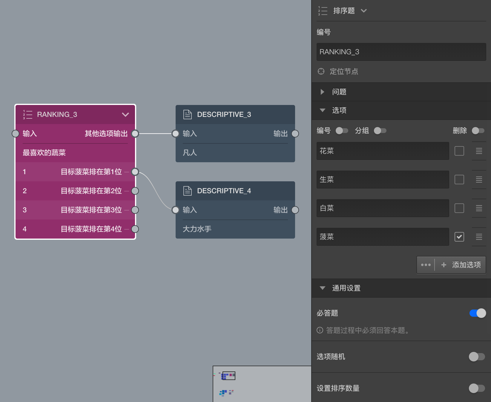

```index

```

```tag

```

```summary

```
# 排序题

> 不同题型或功能节点共有的通用设置在[节点设置](../node-setting/concept.md)中有讲解，此处只讲解排序题特有的功能。

排序题也像选择题一样提供一系列选项，被访者按题目要求对这些选项排出先后排序。

> 选项被排序是指拖动选项，并放置到新的位置，当选项被移动到新位置后，选项前会显示一个序号数字。



### 排序目标

排序题主要用于获得被访者排列选项的顺序，因此排序题选项默认没有输出口。

有时，我们会关注选项中的某个选择被排序后的所在位置，该选项成为`目标选项`。此时，勾选选项前的勾选项，将该选项设定为`目标选项`，也就是排序关注目标。这时，画布中排序题的选项会出现输出口，这里的选项输出口是指：如果排序目标选项被排到该选项所在的顺序位置，就从这里出去找下一题。

如上图中，我们勾选了菠菜为排序目标，同时从第1个选项输出到大力水手的描述节点，意思是说如果被访者将菠菜排在第1位，我们就说他是`大力水手`，否则会走总输出口到达`凡人`的描述节点。

> 排序题只能把一个选项设定为排序目标，如果想关注多个排序目标，则需要使用[逻辑节点](./logic.md)。

### 设置排序数量

默认情况下，排序题要求所有选项都被移动过位置，也就是所有选项的序号都排出来后才能进行下一题。手动设置排序数量后，可以避免所有选项必须被排序的限制，只要被排序选项的数量达到设定数量就可以进入下一题。
