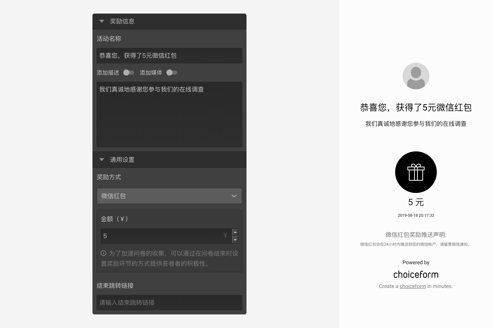
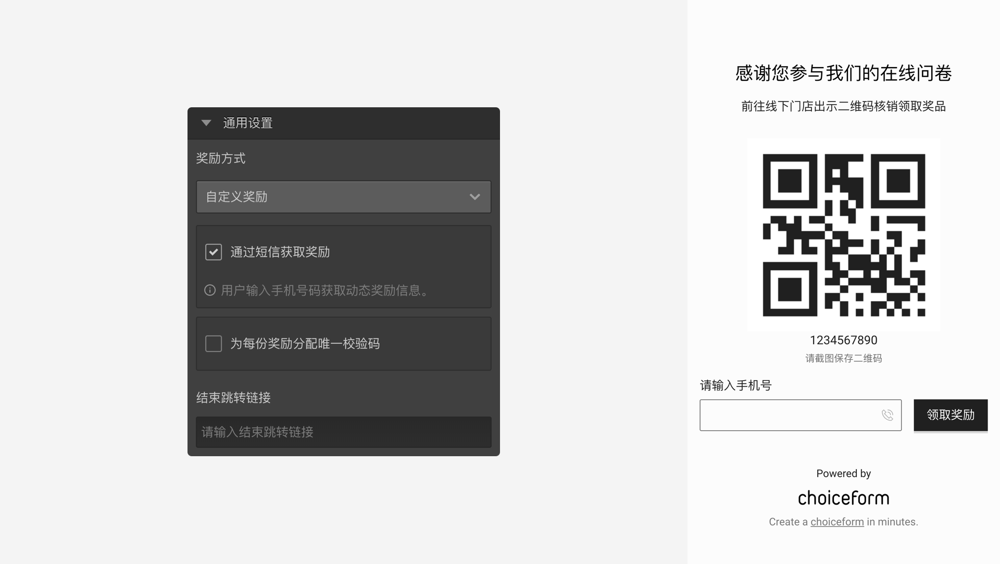
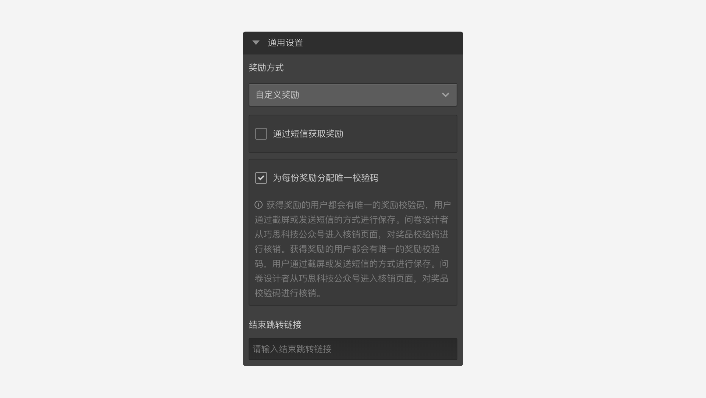

–```index

```

```tag

```

```summary

```
# 奖励节点

奖励节点用于发放微信红包等奖励，对认真完成问卷并提交数据的被访者给予奖励，是一种很好的用户体验。


奖励节点没只能连接以下2种节点：
+ 结束节点：在结束节点里开启奖励，随后连接到奖励节点。
+ 抽奖节点：在结束节点里开启奖励，随后连接抽奖节点，再把抽奖节点连接到奖励节点。

## 通用设置



+ 奖励方式：
分为微信红包和自定义奖励两种。
  + 微信红包：可指定发放红包的金额，被访者答完后领取红包；
  + 自定义奖励：奖励靠第三方发放，支持发送获奖短信与分配核销码的方式，被访者可以凭短信或核销码到第三方机构领取奖励。
  
  


关于资金扣除，奖励发放等具体功能介绍，参见[奖励机制](../advance-topic/reward.md)。

+ 结束跳转链接：
指定一个URL地址，当领取完奖励后，页面跳转到该地址。

> 不同题型或功能节点共有的通用设置在[节点设置](../node-setting/concept.md)中有讲解，此处只讲解奖励特有的功能。
