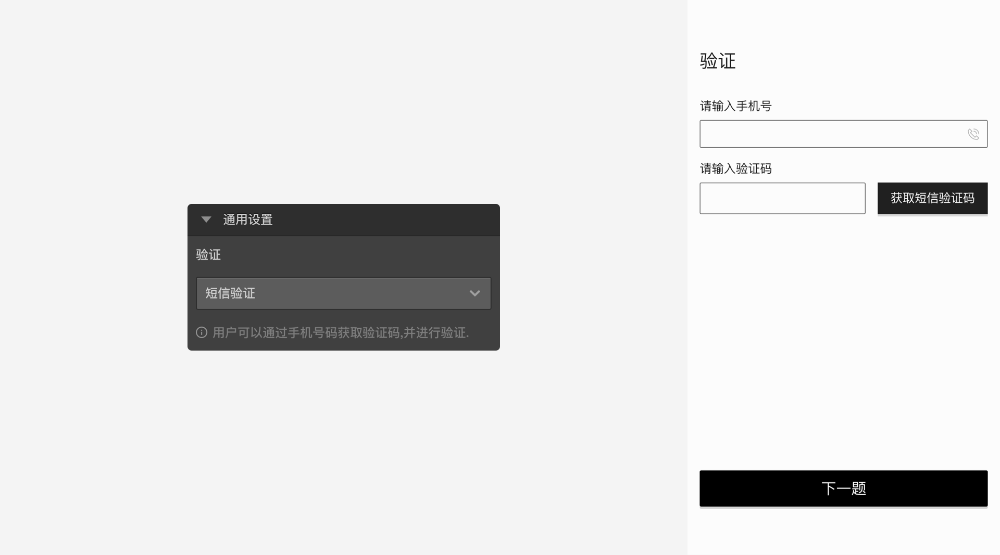
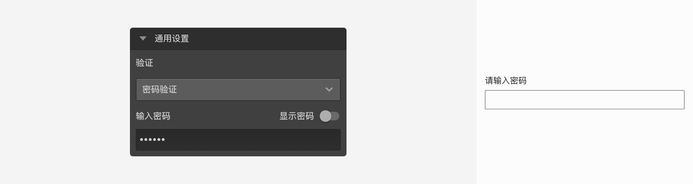
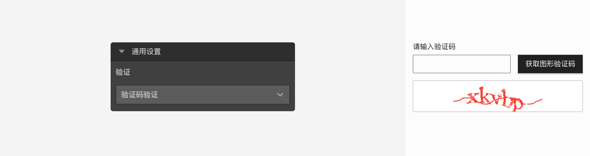

```index
22
```

```tag

```

```summary

```
# 验证节点

`验证节点`用于确定被访者是否符合要求，不能通过验证的被访者无法继续答题。


## 通用设置

`验证节点`支持三种验证方式：`短信验证`、`密码验证`、`验证码验证`。

+ 短信验证：
  
被访者输入手机号码后获取验证码，输入验证码后，点击下一题进行验证。

+ 密码验证：
  
在`验证节点`中设置密码，然后只告诉目标被访者密码内容，被访者在答题时输入密码后，点击`下一题`按钮进行验证。

+ 验证码验证：
  
被访者点击获取图像验证码，然后填入图像验证码上的字符，然后点击下一题，点下一题即可进行验证。

> 除了验证节点外，还可以使用自定义验证完成个性化的验证。

> 不同题型或功能节点共有的通用设置在[节点设置](../node-setting/concept.md)中有讲解，此处只讲解验证节点特有的功能。
