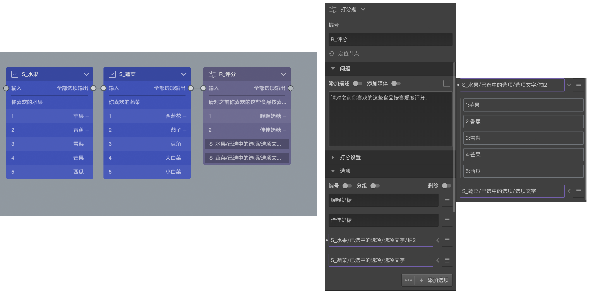

```index
1
```
```tag

```
```summary
```

# 选项引用基本概念

题目除了可以自己添加指定选项之外，还能引用之前某些节点的某些选项，这就叫做`选项引用`，选项引用是通过变量来实现的，点击选项设置区中的[高级控制](../node-setting/option.md#高级控制)按钮组中的`选项引用`按钮，就会打开[变量选择器](../variable/usage.md#变量选择器)，选择某个变量就会生成一个`选项引用`配置，通过这个配置可以生成若干个`引用选项`。




结合上图的实例进行说明：前两个多选题询问喜欢的水果和蔬菜，受访者可能分别选择若干项，第三题对一些食品进行打分，除了指定的两种食品外，还分别引用了前两题中受访者选中过的选项，后面这两个就是引用配置，通过使用`【S1_水果/已选中的选项/选项文字】`和`【S2_蔬菜/已选中的选项/选项文字】`这两个[隐式变量](../variable/implicit.md)的方式来从前面两题引用(借用)选项。

`选项引用`配置设置好了就会为这道题生成引用选项，那到底会生成那些选项呢，大部分时候只有受访者答完前两道题才能知道。在编辑栏中，会提前列出所有可能别引用到的选项，以供观察，点击`选项引用`配置右侧的小箭头，就会在`选项引用`配置的下方看到列出的所有可能被引用过来的选项，这些选项为区别自己自身的选项，被称为`引用选项`，如果普通选项可以进行[附加设置](../node-setting/option.md#附加设置)，那么`引用选项`也可以进项附加设置。

看完上面的的说明，相信已经明白了`选项引用`和`引用选项`这两个长得这么像的称呼的区别与关系了，`选项引用`是一个引用变量生成的引用配置，是手段，而`引用选项`则是是它的结果，是一堆选项。

在上述例子中，如果受访者在第一题选中了`苹果`和`香蕉`，在第二题选中了`大白菜`和`小白菜`，则第三题中打分的时候就需要对`喔喔奶糖`,`佳佳奶糖`,`苹果`,`香蕉`,`大白菜`,`小白菜`,这六个项目进行选择。

`选项引用`配置还可以应用变量过滤器进行设置，点击这个配置项就会弹出`变量过滤器`，在其中可以设置过滤条件，如上图中的第一个`选项引用`配置末尾还有个`抽2`的描述，其实就是在`变量过滤器`中设置了随机抽取2个，这样的话如果第一题中选了了5个选项，则只会在其中随机拿出2个引用过来，而第二个题如果选中5个，则5个都会被引用过来。


## 选项引用过滤器
> 引用选项在经过[选项引用过滤器](../opt-reference/concept.md)处理时可能会被随机打乱顺序，与选项随机功能不冲突，但可以配合使用。

选项引用选项过滤器的随机和题目随机互相配合能达到以下组合效果：

|随机目标|实现方式|
|:---|:--|
|引用选项随机，自身选项不随机                            |引用选项随机顺序，节点级别不随机|
|引用选项不随机，自身选项随机                            |节点级别开启随机，同时开启顺序追随引用源|
|随机抽取后引用选项不随机，自身选项也不随机               |什么都不设置|
|从多个引用源引用选项，某些源随机，某些源不随机             |每个引用设置中单独可设置打乱顺序与否|
|选项引用不抽取，但要随机顺序且仅引用部分选项随机顺序，自身选项不随机                     |选项引用设置打乱顺序即可|
|多个题目引用相同的选项，希望引用到的结果是随机打乱顺序，但是每个题目的打乱顺序得是一样的    |制作一个中间隐藏容器引用原始选项并打乱，然后其他题引用这个容器的选项.


还有跟多设置都可参考[变量过滤器](../variable/filter.md)