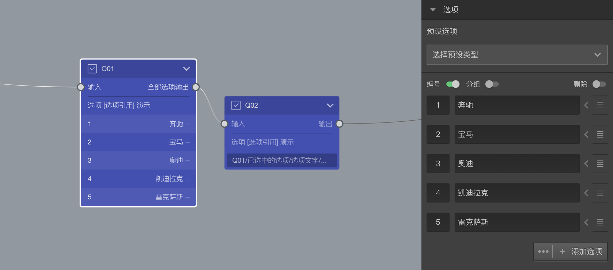
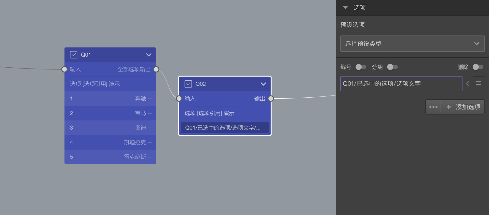
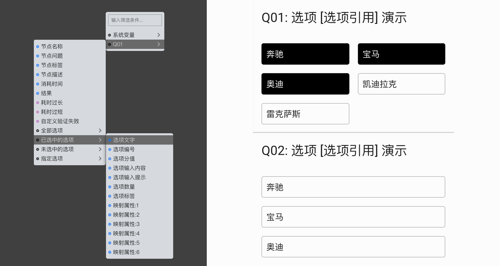

```index
1
```
```tag

```
```summary
```

# 选项引用基本概念

题目除了可以自己添加指定选项之外，还能引用之前其他节点的指定选项，这就叫做`选项引用`。选项引用通过变量引擎来实现，点击选项`附加设置`的[高级控制](../node-setting/option.md#高级控制)弹出菜单中的`选项引用`，打开[变量选择器](../variable/usage.md#变量选择器)进行引用配置，下面我们用几个案例来说明选项引用的使用方法。

首先，按下面图示，创建2个选择题节点，并设定Q01的选项。

随后，设置Q02的选项。

点击后打开`变量选择器`，就可以对引用进行配置了，下图是选择"Q01/已选中的选项/选项文字"后的效果，Q02项引用Q01中已选中选项的文字内容：


+ 引用不同的属性：选项引用时，可以选择引用选项的不同属性，以满足不同的需求。
下图是Q02的选项引用Q01中已选中选项的选项编号：


## 选项引用过滤滤器

`选项引用过滤器`可以对可被引用的选项进行进过滤筛选。

+ 叠加过滤条件：可以对引用过来的选项再叠加判断条件。点击Q02的引用选项，弹出过滤设置面板。

按下图设置，我们可以在Q02中仅仅引用Q01中选项编号大于1的选项的文字。

其实，除了编号外，还可以判断一切其他的属性，有以下可判断属性：


+ 从符合条件的选项中随机抽取引用：可以从符合条件的所有选项中，抽取一部分引用到当前题目。
下图是Q02的选项从Q01中已选中选项抽取2个，并引用抽取到的选项的编号。

再进一步，还能对抽取到的选项进行随机排序。


## 选项引用与随机的配合

引用选项在经过`选项引用过滤器`处理时可能会被随机打乱顺序，与选项随机功能不冲突，但可以配合使用达到以下组合效果：

|随机目标|实现方式|
|:---|:--|
|引用选项随机，自身选项不随机                            |引用选项随机顺序，节点级别不随机|
|引用选项不随机，自身选项随机                            |节点级别开启随机，同时开启顺序追随引用源|
|随机抽取后引用选项不随机，自身选项也不随机               |什么都不设置|
|从多个引用源引用选项，某些源随机，某些源不随机             |每个引用设置中单独可设置打乱顺序与否|
|选项引用不抽取，但要随机顺序且仅引用部分选项随机顺序，自身选项不随机                     |选项引用设置打乱顺序即可|
|多个题目引用相同的选项，希望引用到的结果是随机打乱顺序，但是每个题目的打乱顺序得是一样的    |制作一个中间隐藏容器引用原始选项并打乱，然后其他题引用这个容器的选项.

> 变量过滤器的更多说明参见[变量过滤器](../variable/filter.md)。