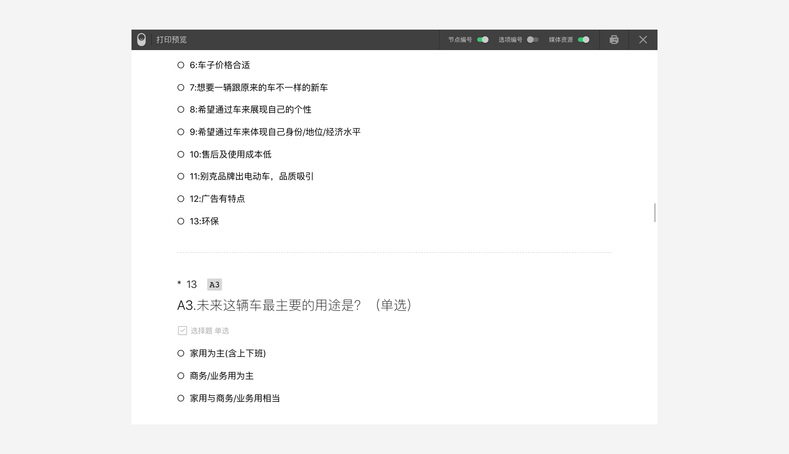
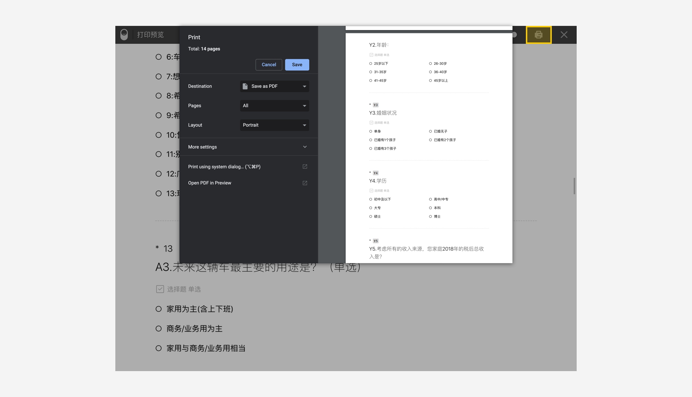

```index
4
```
```tag

```
```summary
```
# 打印预览

问卷编辑器左侧的问卷组件工具栏下方有一个`打印预览`按钮，点击后打开`打印预览`页面。

打印预览页面可以快速以传统纸质问卷的问题列表文档方式查看整个问卷的流程。对于复杂的问卷，打印预览也会尽量以列表文档方式描述清楚整个问卷的流程关系，便于快速查看问卷流程。
> 生成打印预览前，要求该问卷已经通过智能引擎的检查，没有任何错误。

下图是一份文件的打印预览效果。


打印预览页面最上方是问卷概要，其后从上到下排列出问卷的所有题目的内容、选项和配置条件。

## 打印预览标记说明

+ ID：题目的开头是题目的ID。
+ `*`标记：说明该题是必答题。
+ SKIP：如果题目ID的后面有一个`SKIP`标记，则代表不需对此题进行作答。
+ 设定规则：如果选项有复杂的设置，如：`显示条件`、`选中条件`、`自动赋值`等等，会在选项下面列出这些设置的详细规则。
+ 跳转目标：如果该选项有输出连线，则会在该选项中注明输出目标。
+ 变量附录：如果问卷使用了变量，页面末尾会有一个附录，其中列出问卷所有变量的信息。

此外，打印预览页中对于单页题目组、随机组、循环圈、逻辑节点也都会用易于理解的方式表现出来。

## 打印控制

打印预览页面最上方的工具栏中有一排按钮，可以控制题目是否显示节点编号、选项标号和媒体资源。


点击`打印`按钮打印当前问卷。
