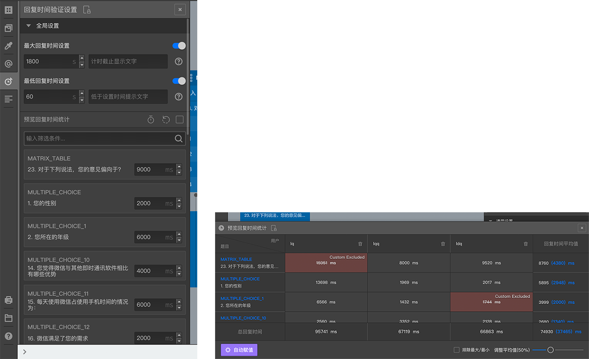

# 时间设置

在设置栏的全局设置中可以设置整个问卷的最大答题时间和最小答题时间，在下面的题目列表中则可以精准控制每道题目的答题时间，

通过点击题目列表上方的小闹钟图标，可以打开时间统计栏，在这一栏里面可以根据多位预览者提交的回复时间样本，通过自定义排除，最大最小排除，然后求平均值来推测某个道题的平均合理时间，然后一键应用到每道题目。

> 关于预览时间样本，请参照[完整预览](../preview/full.md#预览时间)

> 一般只有对时间非常敏感的问卷或题目才需要使用时间设置，普通问卷使用时间设置可能会弄巧成拙，请谨慎使用。