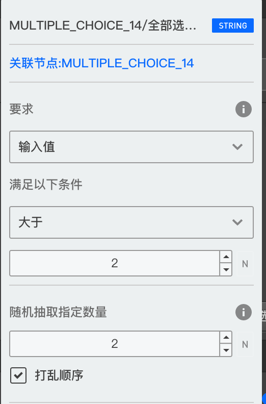

# 变量过滤器

在富文本框中插入的变量标签和选项设置中增加的选项引用设置项，在被点击后都会弹出一个`变量过滤器`编辑栏，在这里面可以继续对这个已引用的变量进行更多设置，以下说明：

## 不记录到回复记录中
勾选后，这个变量在答案统计中不会被显示出来，只对富文本中插入的变量标签可用。

## HTML变量占位符设置
可以对[HTML的占位符](./html-type.md#HTML占位符)设置具体的值，只对富文本中插入的HTML变量标签可用。

## 媒体尺寸
可以设置图片出入到文本中展示是的高度和宽度，只对富文本中插入的的媒体变量标签可用。

## 过滤条件
仅针对于从[节点的选项分组中](./implicit.md#节点中抽取的常用变量组)抽取的变量可用。

可以进行进一步的过滤操作，要求只引用某个数据满足某些[逻辑判断规则](../logic/opr-rule.md)的变量结果.

+ `要求`：点击下拉列表可以选择要求的条件。
+ `满足以下条件`：下拉列表和输入框控制，使用的是[逻辑判断规则](../logic/opr-rule.md)

## 随机抽取
仅针对于从[节点的选项分组中](./implicit.md#节点中抽取的常用变量组)抽取的变量可用。

出了上面的要求某个内容满足某些条件，还可以在此基础上只随机抽取若干内容。

## 打乱顺序
仅针对于从[节点的选项分组中](./implicit.md#节点中抽取的常用变量组)抽取的变量可用。

勾选后，抽到的选项结果列表的顺序会被打乱。

案列：某个打分题`S1`共有10个选项，在该题的后面一道题中引用该题的的选项。

规则如下
1. 选项引用配置的规则为`S1/已打分选项/选项文字`
2. 然后我们再使用`过滤条件`：在`要求`栏的下拉列表中选择`分值`，在`满足以下条件`栏中选择`大于`,且输入框中输入`4`，
3. 然后在随机抽取中选择抽取`2`个。

现在假设某次答题是，在`S1`中对8个选项进行了打分，分别是`1,2,3,4,5,6,7,8`分，这时候：
1. 经过`规则1`，会引用到`8`个选项（未打分的会被丢掉）。
2. 再经过`规则2`会引用到`4`个选项（4分及以下的不满足要求被丢掉）
3. 再经过`规则3`会引用到2个选项（只要随机抽取2个）。
> 如果经过前两步的规则就只剩下不到2个选项，则第3步就不再抽取。

如图：

这个功能对插入的标签和选项引用配置都有效。
