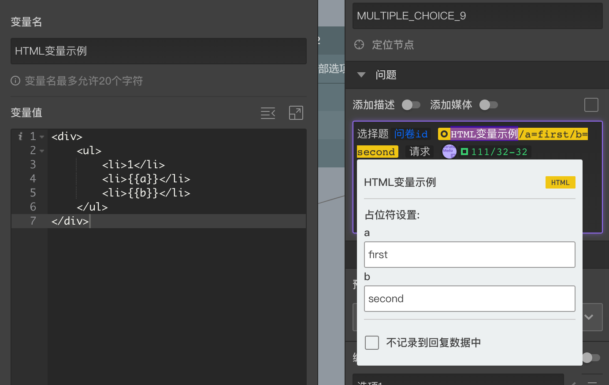

```index
7
```
```tag

```
```summary
```

# HTML变量

HTML是变量类型的一种，主要用于在答题页面中添加自定义的样式内容。同时也可以用某些HTML技巧，调整答题页面已有的内容展示方式，一般在问题文字和选项文字中使用。

`HTML变量`的变量值输入框是一个代码编辑器，其中可以输入任何有效的HTML代码和内嵌在style标签下的CSS样式代码。输入框右上方有两个按钮，点击后分别可以整理代码和将输入框变成全屏模式。



## HTML占位符

在HTML代码中如果输入`{{XXX}}`格式的代码，就创建了一个占位符其中`XXX`，半角的花括号作为占位符声明的开始和结束。有占位符的变量被使用后，点击插入的变量标签会弹出`变量过滤`面板，在面板中可以设置占位符的具体值，在答题页中被展示时，占位符就会被替换为真实的内容。

## 全局模式

如果在某个`HTML变量`的名称包含`TO_GLOBAL`字符，则这个HTML会被注入到答题页面的头部，这种情况下只对样式代码有效，通过这种方式可以自定义样式代码并改变整个答题页的展示样式效果。

