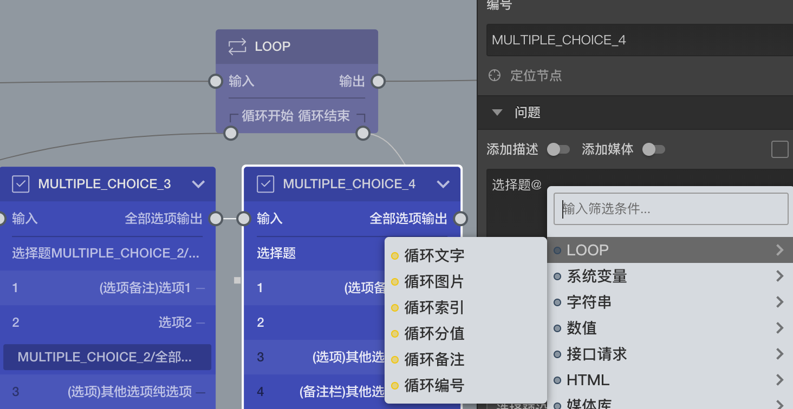

```index
8
```
```tag

```
```summary

```

# 循环变量

循环变量是变量类型的一种，和其他几种变量类型不一样，循环变量不可以在`自定义变量`中被手动添加，循环变量只能是`隐式变量`。



一般情况下，循环变量只能在某个[循环节点](../nodes/loop.md)的循环圈节点内被访问到，引用的时候可以尝试从对应于节点名称的循环变量中抽取文字，图片，索引的内容。

内层循环圈节点同时可以访问到内层和外层两个循环节点的循环变量。

> 通过内置的[上下文变量](./build-in.md#上下文)也可以访问到循环变量，但是要注意使用时机。

